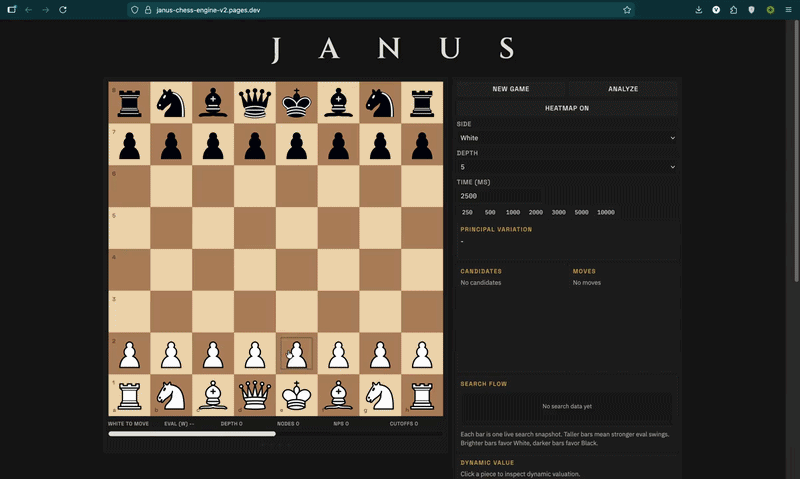
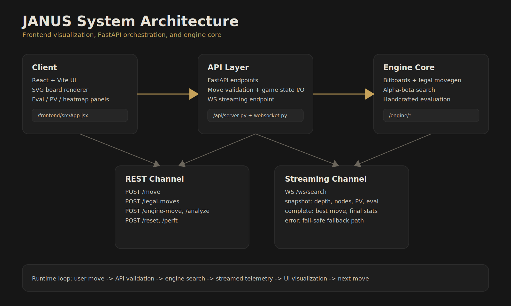
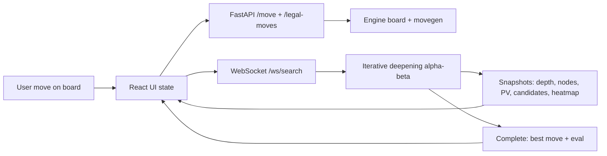
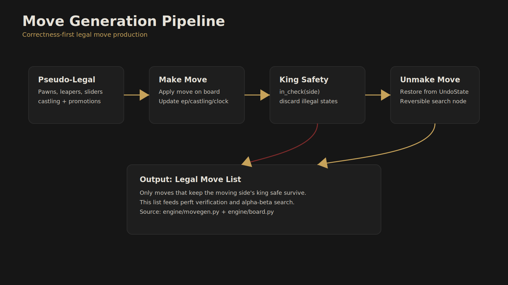
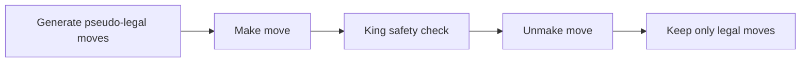
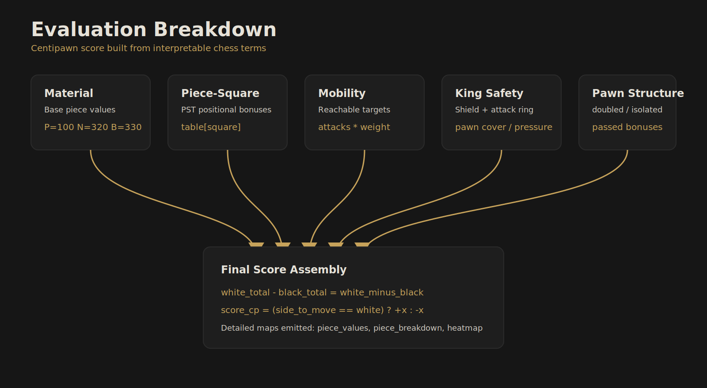
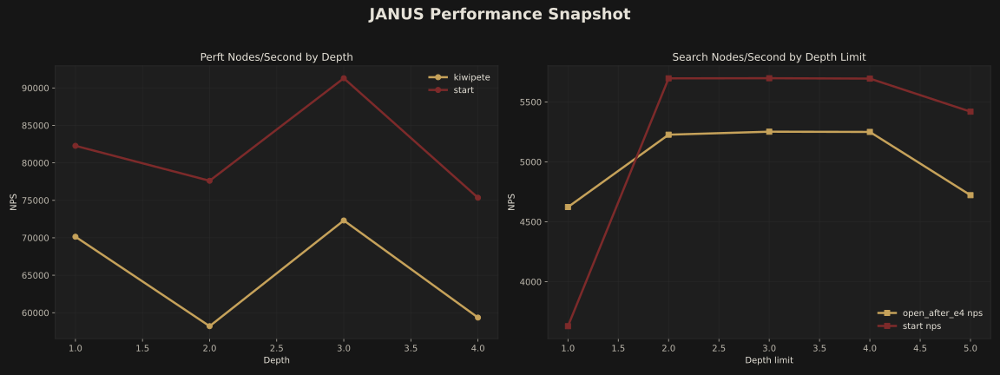
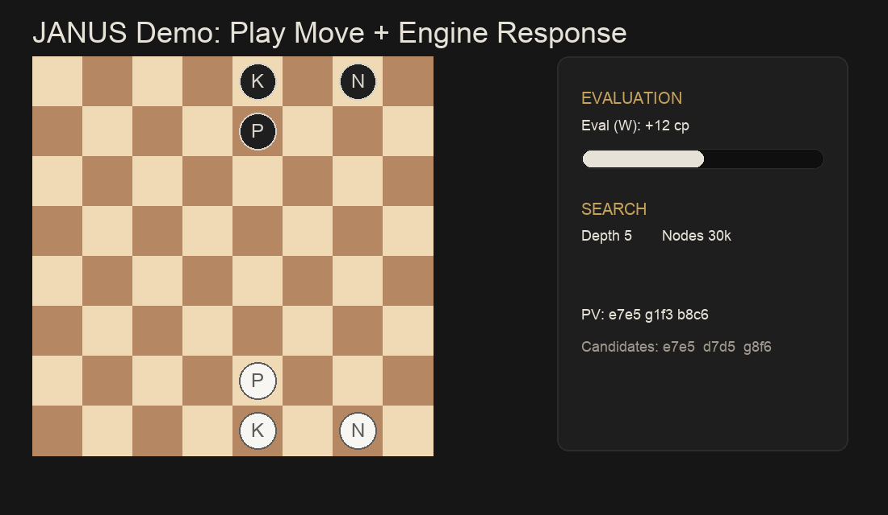
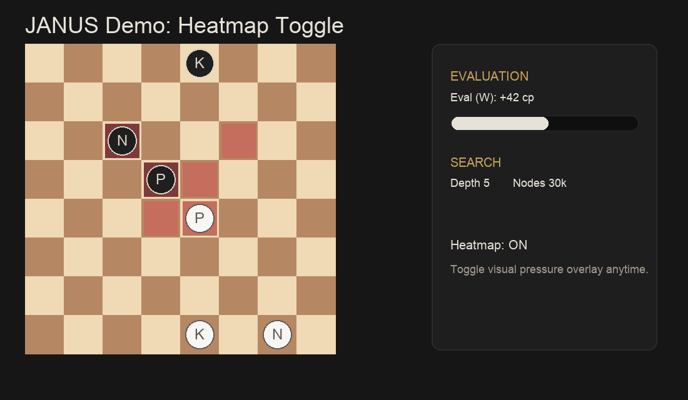
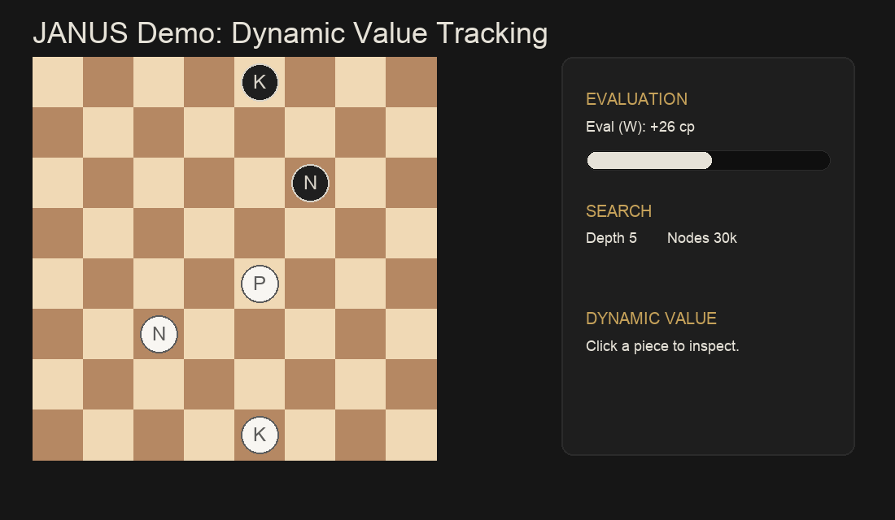

# JANUS: Chess Engine & Live Eval

<p align="center">
  
</p>

<p align="center">
  A classical chess engine with a real-time analysis interface that exposes search behavior, evaluation logic, and decision telemetry.
</p>

<p align="center">
  
</p>

## What JANUS Shows
JANUS is designed to make engine decisions understandable, not opaque.

- Legal move generation built on reversible make/unmake state transitions
- Perft-verified correctness on known reference positions
- Iterative deepening alpha-beta search with live instrumentation
- Explainable evaluation breakdown (material, PST, mobility, king safety, pawn structure)
- Interactive board overlays: PV arrows, candidate ranking, heatmap, dynamic piece values

### 1) Architecture




### 2) Movegen Pipeline




### 3) Evaluation Breakdown


### 4) Performance Charts (Generated from CSV)


| Demo | Preview |
|---|---|
| Play move + engine response |  |
| Heatmap toggle |  |
| Dynamic value click tracking |  |

## Tech Stack
- **Engine:** Custom Python implementation (bitboards, legal movegen, search, evaluation)
- **Backend:** FastAPI + Uvicorn + WebSockets
- **Frontend:** React (Vite), SVG board rendering
- **Testing:** Pytest perft + movegen + search + evaluation tests

## Quick Start
### Prerequisites
- Python 3.11+
- Node.js 18+

### Install
```bash
python3 -m venv .venv
source .venv/bin/activate
pip install -r requirements.txt

cd frontend
npm install
cd ..
```

### Run locally
Terminal A (backend):
```bash
source .venv/bin/activate
python3 -m uvicorn api.server:app --host 127.0.0.1 --port 8000 --reload
```

Terminal B (frontend):
```bash
cd frontend
cp .env.example .env
npm run dev
```

## Reproducible Benchmarks and Visuals
Install visualization dependencies (one-time):
```bash
pip install -r requirements-docs.txt
```

Generate benchmark CSV files:
```bash
python3 scripts/bench.py
```

Render performance chart SVG from CSV:
```bash
python3 scripts/plot_metrics.py
```

Regenerate demo GIF pack:
```bash
python3 scripts/generate_demo_gifs.py
```

Outputs:
- `docs/metrics/perft_metrics.csv`
- `docs/metrics/search_metrics.csv`
- `docs/visuals/performance-charts.svg`
- `docs/visuals/demo-*.gif`

## Correctness (Perft)
| Position | Depth | Expected | Actual |
|---|---:|---:|---:|
| Start position | 1 | 20 | 20 |
| Start position | 2 | 400 | 400 |
| Start position | 3 | 8902 | 8902 |
| Start position | 4 | 197281 | 197281 |
| Kiwipete | 2 | 2039 | 2039 |
| Kiwipete | 3 | 97862 | 97862 |

Run full test suite:
```bash
python3 -m pytest -q
```

## Repository Layout
```text
api/                FastAPI endpoints + websocket streaming
engine/             bitboards, board, movegen, perft, search, evaluation
frontend/           React + SVG visualization app
tests/              correctness and behavior tests
scripts/            benchmark + plotting + gif generation scripts
docs/metrics/       generated benchmark CSV files
docs/visuals/       architecture/search/eval SVGs + demo GIFs
```
