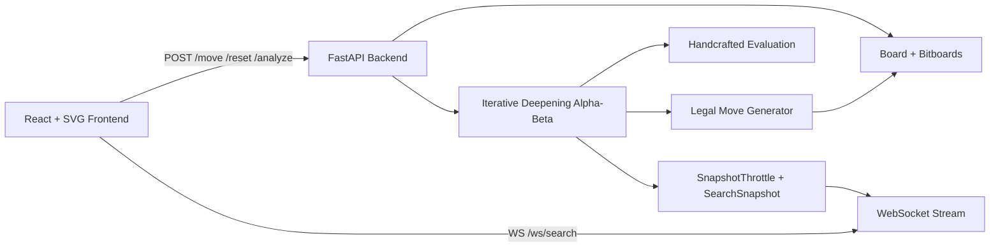

# Chess Engine + Live Visualization Platform

Performance-oriented classical chess engine + real-time web visualization.

## Live Project Scope
- Bitboard board model with reversible make/unmake
- Pseudo-legal + legal move generation
- Perft validation suite (non-negotiable correctness gate)
- Iterative deepening negamax alpha-beta search with time control
- Handcrafted centipawn evaluation (material, PST, mobility, king safety, pawn structure)
- Throttled search instrumentation snapshots over WebSocket
- React + SVG interactive board with live engine telemetry panels

## Architecture


## Engine Design
### Phase 1: Board + Bitboards
- 12 piece bitboards + white/black/all occupancy bitboards
- Full board state: side-to-move, castling rights, en passant, clocks
- Reversible `make_move`/`unmake_move` with state history

### Phase 2: Move Generation (Critical)
- Pseudo-legal move generation for pawns/knights/kings/sliders
- Sliding pieces use **precomputed rays for all 64 squares**
- Legal filtering: pseudo move -> make -> king safety check -> discard illegal -> unmake

### Phase 3: Perft (Correctness Gate)
- `perft(position, depth)` and `perft_divide`
- Fails fast in tests if known perft values mismatch

### Phase 4: Search
- Negamax alpha-beta with node counting and cutoff counting
- Iterative deepening (best move per completed depth)
- Hard time limit with safe timeout abort

### Phase 5: Evaluation (Centipawns)
Evaluation includes all required components:
- Material balance
- Piece-square tables
- Mobility bonus
- Basic king safety
- Pawn structure:
  - Doubled pawns
  - Isolated pawns
  - Passed pawns

Also exposes explainability data:
- Per-piece contribution breakdown (base/pst/mobility/pawn_structure/king_safety/total)
- Piece value map for UI overlays
- Board pressure heatmap

### Phase 6: Instrumentation
Search emits throttled snapshots (`~80ms` default):
```json
{
  "depth": 6,
  "nodes": 153294,
  "nps": 412000,
  "current_move": "e2e4",
  "pv": ["e2e4", "e7e5", "g1f3"],
  "eval": 0.42,
  "eval_cp": 42,
  "candidate_moves": {"e2e4": 0.42, "d2d4": 0.31},
  "piece_values": {"g1": 312, "f5": -372},
  "piece_breakdown": {"g1": {"base": 320, "pst": -8, "mobility": 0, "total": 312}},
  "heatmap": {"e4": 3, "d5": 2},
  "cutoffs": 941,
  "elapsed_ms": 823.5
}
```

## API
### HTTP
- `GET /health`
- `POST /analyze` -> evaluate/search current position
- `POST /move` -> play a move (`fen`, `move`)
- `POST /reset` -> reset to start FEN (or supplied FEN)
- `POST /legal-moves` -> legal moves for a FEN
- `POST /perft` -> perft/perft-divide

### WebSocket
- `WS /ws/search`
- Streams throttled `snapshot` events and one `complete` event

## Frontend UI
- Left panel: interactive SVG board
  - Click-to-move
  - Live PV/candidate arrows
  - Current searched move highlight
  - Heatmap overlays
- Right panel: engine instrumentation
  - Depth / Nodes / NPS / Eval bar
  - PV panel
  - Candidate move ranking (live reorder)
  - Dynamic piece valuation inspector (hover square)
  - Search progression mini-timeline + cutoff counters

Piece assets:
- Uses Lichess `cburnett` SVG pieces in [frontend/public/pieces/cburnett](/Users/vedang/Desktop/Projects/Chess_engine/frontend/public/pieces/cburnett)

## Perft Correctness Proof
| Position | Depth | Expected | Actual |
|---|---:|---:|---:|
| Start position | 1 | 20 | 20 |
| Start position | 2 | 400 | 400 |
| Start position | 3 | 8902 | 8902 |
| Start position | 4 | 197281 | 197281 |
| Kiwipete | 2 | 2039 | 2039 |
| Kiwipete | 3 | 97862 | 97862 |

Run validation:
```bash
python3 -m pytest -q
```

Current status: `24 passed`.

## Performance Metrics (Local)
Measured on this implementation:
- Search benchmark (start position, `max_depth=5`, `time_limit_ms=4000`)
  - completed depth: `3`
  - nodes: `3084`
  - nps: `5804`
  - elapsed: `531 ms`
- Perft benchmark (start position, depth 4)
  - nodes: `197281`
  - elapsed: `2555 ms`
  - nps: `77213`

## Screenshots / Visual Assets
- UI overview: 
- Search flow: 

## Local Run
### Backend
```bash
cd /Users/vedang/Desktop/Projects/Chess_engine
python3 -m pip install -r requirements.txt
python3 -m uvicorn api.server:app --reload
```

### Frontend
```bash
cd /Users/vedang/Desktop/Projects/Chess_engine/frontend
npm install
npm run dev
```

Open `http://localhost:5173`.

## Deployment
### Backend (Fly.io / Render / Railway)
- Service start command: `python3 -m uvicorn api.server:app --host 0.0.0.0 --port $PORT`
- Set env var: `PYTHONUNBUFFERED=1`

### Frontend (Cloudflare Pages)
- Build command: `npm run build`
- Output directory: `dist`
- Env var: `VITE_API_BASE=https://<your-backend-domain>`

### Shareable URL
- Final single URL requires your deployment account credentials (Fly/Render/Railway + Cloudflare).
- Once deployed, use Cloudflare custom domain (or Pages domain) as the single shareable URL.

## Known Limitations
- No transposition table / Zobrist hash yet
- No quiescence search yet
- No opening book / endgame tablebases
- UI uses click-to-move; drag-and-drop promotion chooser is pending
- Search strength is correctness-first; performance optimization is still ongoing
