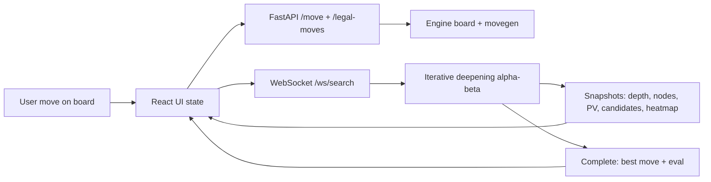
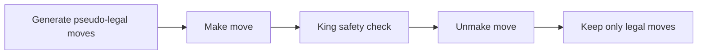

# JANUS: Chess Engine & Live Eval

<p align="center">
  
</p>

<p align="center">
  A classical chess engine with a real-time analysis interface that exposes search behavior, evaluation logic, and decision telemetry.
</p>

<p align="center">
  
</p>

## What JANUS Shows
JANUS is designed to make engine decisions understandable.

- Legal move generation built on reversible make/unmake state transitions
- Perft-verified correctness on known reference positions
- Iterative deepening alpha-beta search with live instrumentation
- Explainable evaluation breakdown (material, PST, mobility, king safety, pawn structure)
- Interactive board overlays: PV arrows, candidate ranking, heatmap, dynamic piece values

### 1) Architecture




### 2) Movegen Pipeline




### 3) Evaluation Breakdown


### 4) Performance Charts (Generated from CSV)


| Demo | Preview |
|---|---|
| Play move + engine response |  |
| Heatmap toggle |  |
| Dynamic value click tracking |  |

## Tech Stack
- **Engine:** Custom Python implementation (bitboards, legal movegen, search, evaluation)
- **Backend:** FastAPI + Uvicorn + WebSockets
- **Frontend:** React (Vite), SVG board rendering
- **Testing:** Pytest perft + movegen + search + evaluation tests

## Engine Internals
### Board Model and State
- 64-bit bitboards stored as Python integers.
- 12 piece bitboards (`WP..WK`, `BP..BK`) plus cached occupancy bitboards (`white`, `black`, `both`).
- Full chess state tracked in-board:
  - side to move
  - castling rights
  - en passant square
  - halfmove/fullmove clocks
- Reversible make/unmake uses an `UndoState` stack, allowing deep search without re-parsing FEN.

### Move Generation
- Precomputed attack tables:
  - pawn attack masks (by side)
  - knight attack masks
  - king attack masks
  - directional rays for sliding pieces
- Movegen flow:
  1. generate pseudo-legal moves (including promotions, en passant, castling)
  2. make move
  3. reject if own king is left in check
  4. unmake move
  5. keep legal move
- This legal filtering path is the same core path used by search and perft.

## Search Algorithm and Pruning
JANUS uses **iterative deepening negamax with alpha-beta pruning**.

### Search Loop
1. Start at depth 1 and iterate to `max_depth`.
2. At each depth, run a full root search over legal moves.
3. Keep best move, PV, candidate ranking, nodes, NPS, cutoffs.
4. Stop safely on time limit (`_SearchTimeout`) and return the best completed depth.

### Negamax Core
- Recursive form: `score = -child_score`.
- Leaf node: handcrafted static evaluation.
- No-legal-move node: terminal score (`checkmate` or `stalemate`).

### Pruning Implemented
- **Alpha-beta cutoff** when `alpha >= beta` (fail-high pruning).
- **Move ordering heuristic** (simple, but effective):
  - captures first
  - then promotions
  - then castling
- Current implementation intentionally does **not** include transposition tables or quiescence search yet.

### Instrumentation During Search
- Live snapshots stream depth, current move, PV, candidate scores, eval, nodes, NPS, cutoffs, heatmap.
- Snapshot emission is throttled (configurable interval) to keep UI responsive and avoid flooding.

## Evaluation Function (Centipawns)
Evaluation is handcrafted and explainable. The engine computes:

`white_minus_black = white_total - black_total`

then converts to side-to-move perspective for search:

`score_cp = white_minus_black` (if White to move) else `-white_minus_black`

### Terms Included
- **Material:** base piece values (`P=100, N=320, B=330, R=500, Q=900`).
- **Piece-square tables (PST):** square bonuses/penalties (mirrored for Black).
- **Mobility:** reachable targets weighted by piece type.
- **King safety:** pawn shield around king + attacked king-ring penalties.
- **Pawn structure:** doubled, isolated, and passed-pawn terms.

### Explainability Outputs
For UI overlays, evaluation also emits:
- per-piece signed values (`piece_values`)
- per-piece term breakdown (`piece_breakdown`: base, pst, mobility, pawn structure, king safety, total)
- tactical pressure heatmap (`heatmap`)

## Quick Start
### Prerequisites
- Python 3.11+
- Node.js 18+

### Install
```bash
python3 -m venv .venv
source .venv/bin/activate
pip install -r requirements.txt

cd frontend
npm install
cd ..
```

### Run locally
Terminal A (backend):
```bash
source .venv/bin/activate
python3 -m uvicorn api.server:app --host 127.0.0.1 --port 8000 --reload
```

Terminal B (frontend):
```bash
cd frontend
cp .env.example .env
npm run dev
```

## Reproducible Benchmarks and Visuals
Install visualization dependencies (one-time):
```bash
pip install -r requirements-docs.txt
```

Generate benchmark CSV files:
```bash
python3 scripts/bench.py
```

Render performance chart SVG from CSV:
```bash
python3 scripts/plot_metrics.py
```

Regenerate demo GIF pack:
```bash
python3 scripts/generate_demo_gifs.py
```

Outputs:
- `docs/metrics/perft_metrics.csv`
- `docs/metrics/search_metrics.csv`
- `docs/visuals/performance-charts.svg`
- `docs/visuals/demo-*.gif`

## Correctness (Perft)
| Position | Depth | Expected | Actual |
|---|---:|---:|---:|
| Start position | 1 | 20 | 20 |
| Start position | 2 | 400 | 400 |
| Start position | 3 | 8902 | 8902 |
| Start position | 4 | 197281 | 197281 |
| Kiwipete | 2 | 2039 | 2039 |
| Kiwipete | 3 | 97862 | 97862 |

Run full test suite:
```bash
python3 -m pytest -q
```

## Repository Layout
```text
api/                FastAPI endpoints + websocket streaming
engine/             bitboards, board, movegen, perft, search, evaluation
frontend/           React + SVG visualization app
tests/              correctness and behavior tests
scripts/            benchmark + plotting + gif generation scripts
docs/metrics/       generated benchmark CSV files
docs/visuals/       architecture/search/eval SVGs + demo GIFs
```
